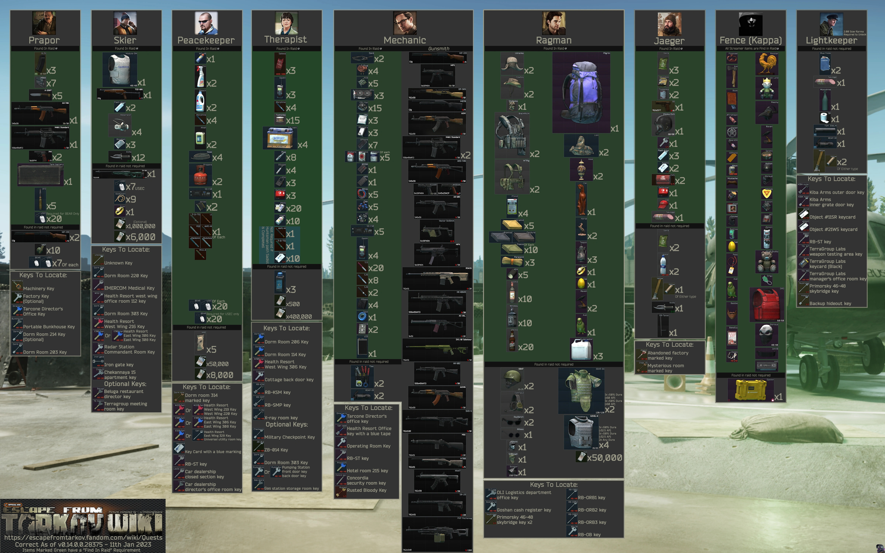

# 👋 About Me

안녕하세요. 관심 있는 기술을 배우면 직접 만들어보고, 만들면 개선하고 싶은 타입입니다.  
데이터 처리, 자동화, 간단한 웹 서비스 구성 등 여러 시도를 해보며 배우고 있습니다.  
완성도가 높지 않은 결과물도 많지만, 시행착오를 겪으며 하나씩 나아지는 과정이 재미있습니다.  
기술을 빠르게 따라가는 것보다, 원리를 이해하고 스스로 적용해보는 것을 더 중요하게 생각합니다.  
앞으로도 흥미 있는 주제를 직접 탐구하고, 작은 결과물이라도 남기면서 성장하고 싶습니다.

 

---

# 🛠️ Skills

현재 학습하고 있는 기술과 관심 있는 분야입니다.

- **언어**: Python, JavaScript  
- **웹**: HTML, CSS, 간단한 웹 페이지 구성  
- **데이터 처리**: 간단한 데이터 수집/정제/분석  
- **자동화 시스템**: 간단한 스크립트 기반 자동화  
- **기타**: Git / GitHub 기본 사용  

> 완벽히 익힌 기술보다,  
> "필요한 기능을 직접 만들 수 있는 능력"을 키우는 데 집중하고 있습니다.

 

---

# 📚 Learning

수업 및 개인 학습을 통해 경험한 내용입니다.

- Git / GitHub를 사용한 버전 관리  
- HTML / CSS / JavaScript 기본 구성  
- 간단한 웹 서비스 제작 및 배포  
- 프로젝트 진행 과정 정리 및 기록  
- 포트폴리오 웹사이트 구축  

> 학습한 내용을 바로 실습해보며  
> 결과물로 정리하는 방식을 선호합니다.

 

---

# 🚀 Projects

학습 과정에서 진행한 작은 프로젝트들입니다.  
아직 완성도가 높진 않지만, 배운 내용을 실험하고 기록하기 위한 목적이 큽니다.

## 📌 GitHub Portfolio Web

  
  

  GitHub Pages와 커스텀 CSS를 활용해 포트폴리오 웹 사이트를 구성해보았습니다.  
  Jekyll 템플릿을 활용해 레이아웃을 분리하고, 간단한 프로젝트 카드 UI를 구현했습니다.
  

  <a href="/projects/github-portfolio" style="text-decoration:none; font-weight:bold;">자세히 보기 →</a>

 

> 프로젝트는 계속 확장하고 있으며, 필요할 때마다 개선 중입니다.

 

---

# 📞 Contact

궁금한 점이나 피드백이 있다면 편하게 연락 주세요.

- GitHub: [https://github.com/yourname](https://github.com/yourname)
- Email: youremail@example.com

